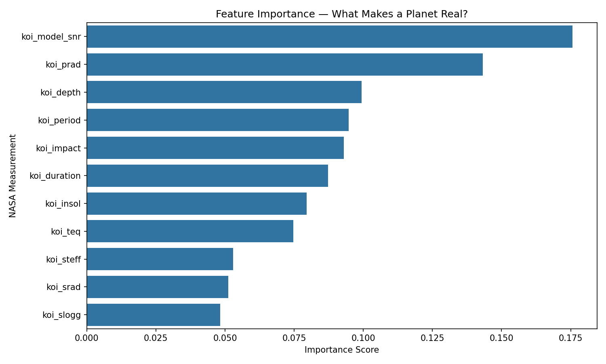
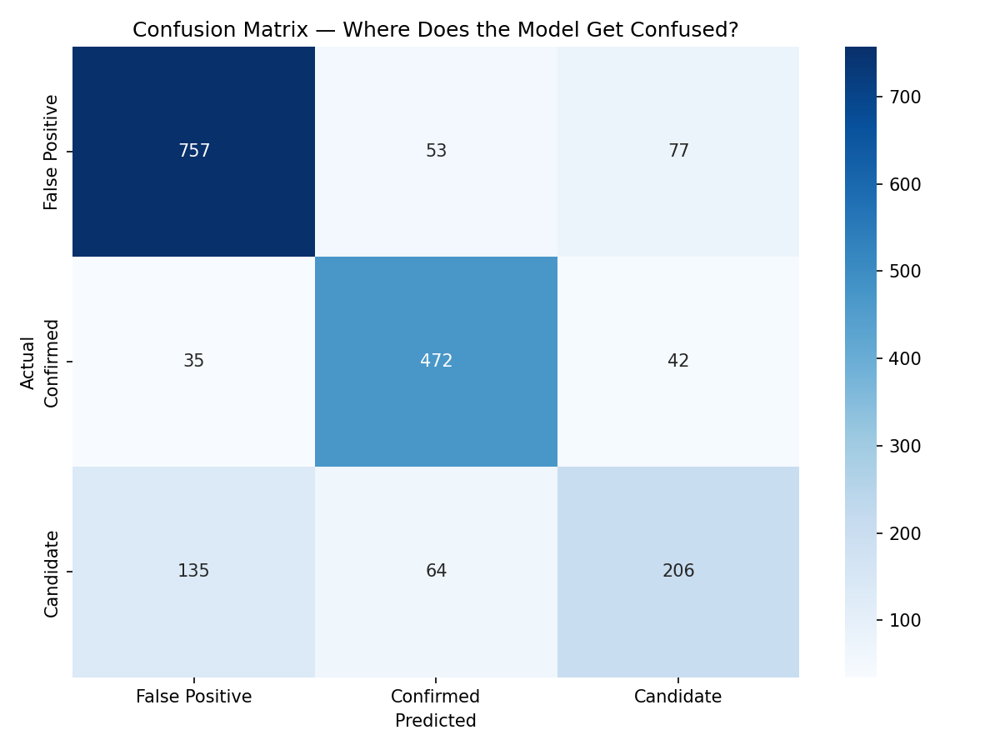
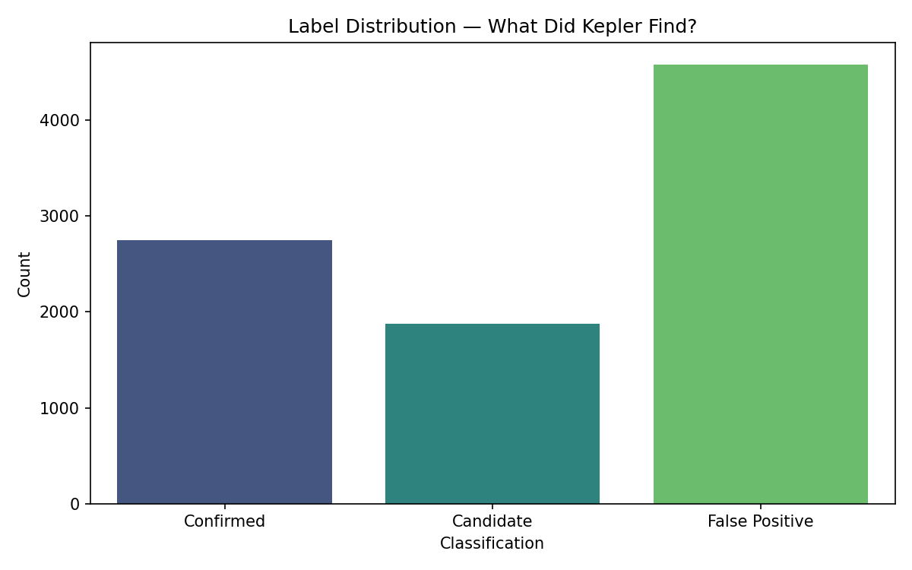

# Exoplanet Classifier

NASA has confirmed over 5,000 planets outside our solar system. None of them have ever been directly seen.

This project uses machine learning to classify exoplanet candidates from the NASA Kepler Space Telescope dataset — detecting real planets from noise using the transit method.

## How It Works

When a planet orbits a star, it periodically crosses between us and the star, causing a brief dip in brightness. This is called the **transit method**. This classifier analyzes those brightness measurements and determines whether a signal is a confirmed planet, a false positive, or an unresolved candidate.

## Results

- **Accuracy:** 78% on held-out test data
- **Best performing class:** Confirmed planets (F1: 0.83)
- **Top feature:** Signal-to-noise ratio (`koi_model_snr`) at 17.6% importance





## Project Structure
exoplanet-classifier/
├── configs/        ← dataset column mappings (works with any NASA CSV)
├── data/           ← place your NASA dataset here
├── plots/          ← generated visualizations
├── src/
│   ├── loader.py       ← data cleaning pipeline
│   ├── features.py     ← feature scaling
│   ├── model.py        ← Random Forest classifier
│   └── visualizer.py   ← plot generation
└── main.py         ← interactive menu


## Setup

```bash
git clone https://github.com/yourusername/exoplanet-classifier
cd exoplanet-classifier
python -m venv venv
venv\Scripts\activate
pip install -r requirements.txt
```

## Dataset

Download the Kepler KOI table from NASA:
https://exoplanetarchive.ipac.caltech.edu/cgi-bin/TblView/nph-tblView?app=ExoTbls&config=cumulative

Save it to `data/` and update the filename in your run command.

## Usage

```bash
python main.py --data data/your_dataset.csv --config configs/kepler.json
```

Then pick from the interactive menu:
- Option 1 — Load and clean data
- Option 2 — Train model
- Option 3 — Evaluate model
- Option 4 — Generate plots
- Option 5 — Run full pipeline

## Works With Any NASA Dataset

This pipeline is config-driven — the Python code never has hardcoded column names.
To use a different NASA dataset, create a new config file in `configs/`.

**Step 1** — Download any dataset from the NASA Exoplanet Archive:
https://exoplanetarchive.ipac.caltech.edu

**Step 2** — Create a new config file, for example `configs/tess.json`:

```json
{
    "feature_columns": [
        "your_feature_column_1",
        "your_feature_column_2"
    ],
    "label_column": "your_label_column",
    "label_map": {
        "CONFIRMED": 1,
        "FALSE POSITIVE": 0,
        "CANDIDATE": -1
    }
}
```

**Step 3** — Run with your new config:

```bash
python main.py --data data/tess.csv --config configs/tess.json
```

The pipeline handles the rest automatically.

## Stack

- Python, pandas, NumPy, scikit-learn, matplotlib, seaborn
- Random Forest Classifier
- NASA Kepler KOI Dataset